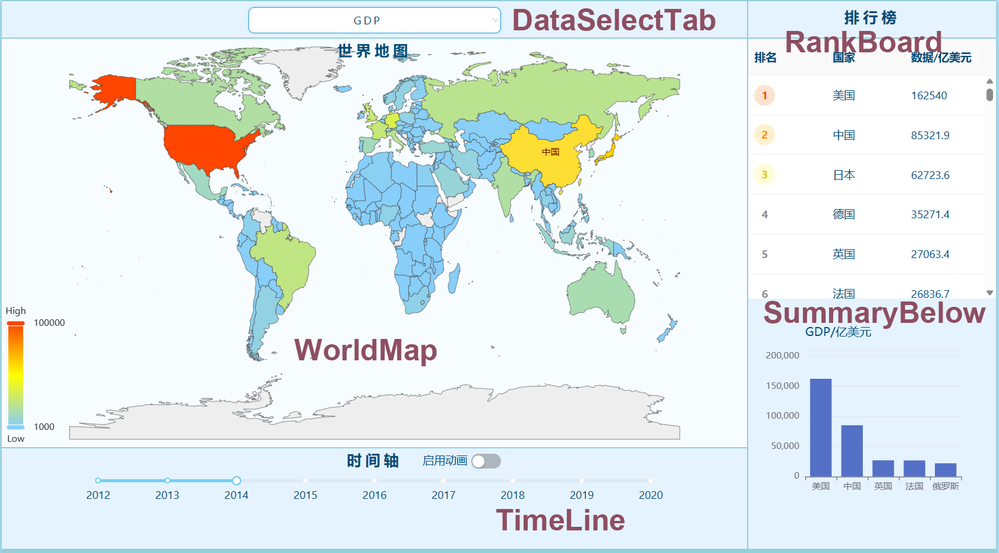

# ZJU SummerSchool-Data Visualization-Example

ㅤㅤ这是浙江大学2023数据可视化暑期学校的小组合作作业，利用世界银行的入学率等教育数据，和大学排名网上的数据，简单地做了一个仪表盘。仅供交流学习。
### **1. 项目配置**
ㅤㅤ经典地，将项目克隆到本地，在终端中输入```npm install```即可安装好全部依赖项。再输入```npm start```即可预览、测试项目。<br/>
ㅤㅤ若要部署项目到服务器，需要先更改根目录下的.env.production文件，将其中PUBLIC_URL的值换成自己服务器的域名路径前缀，以正确定位到资源。再使用```npm run build```将项目打包。
### **2.文件结构**
ㅤㅤpublic目录下是所有的静态资源，其中
- CollegeEnrollRate.csv
- EduExpenseOfGDP.csv
- GDP.csv
- MiddleEnrollRate.csv
- Top100University.csv
- Top1000University.csv

ㅤㅤ都是数据源文件，对应国家6个维度的指标和排名。而ChiEngcountry.csv则类似于一个字典，将国家编码翻译成国家中文名，并提供该国家在地图上的坐标点（坐标点由地图的多边形集合取几何中心算得）
ㅤㅤsrc目录下是主要代码。index.js只定位根节点，引入App组件，index.css记录了全部的样式。剩下的脚本组成了以下的框架。


ㅤㅤ下面是两张视图-组件的对应图片：



### **3. 拓展**
ㅤㅤ~~相比大佬们支持在线上传、绑定数据图表，还有各种数据处理算法内嵌其中的项目，这个真的弱爆了~~

ㅤㅤ作为作业写得太匆忙，并无太多拓展性，很多小图表组件是硬编码，但世界地图组件尚有可取之处，可以往世界地图加减数据，之后用input实现自定义数据上传也很容易。加减数据项的步骤如下：
- 需要一份与public目录下的几个.csv文件相同格式的表格，即表头有Code（国家编号）、年份(如2023)和年份+Rank(如2023Rank)，即可构成一份可识别的数据。
- 往常量表中添加你的配置：在dataSelectTab/dataStorage.js中，找到DataTypeEnum，在其中按索引往下添加新的键
```javascript
export const DataTypeEnum = Object.freeze({
    ...
    MyNewDataType:7,
});
```
- 最后往下面的ConstMetaData中添加一项即可。
```js
const ConstMetaData= Object.freeze([
    ...
    {
        fileName:"CSVFileName",
        boundaryYear:{ startYear: 2012, endYear: 2020 },
        tag: "新数据的名称描述",
        unit: "新数据的单位" 
    },    
]);
```

  ㅤㅤ之后图表组件绑定数据的部分，可以直接根据这个datatype的键获取数据。
  ```js
  getDataByYear(DataTypeEnum.MyNewDataType,2020);
  //获取一个数组，表示该年所有国家的数据，已经将MyNewDataType数据装填到value中，返回的结果可以直接作为echart图表options中series[0]的data。
  ```
  ㅤㅤ在减数据时，得把worldMap目录中硬编码的CountryRadarChart.js、EnrollChart.js、UniDataChart.js删去，并在WorldMap.js中删去它们的组件引用。或者可以魔改它们，在聚焦到国家时显示什么图表都可以。

  ㅤㅤ最后，对于该短学期课程建议，可以多预习react，特别是数据绑定与组件传值；并在数据的有趣程度、图表的联动（即点选/框选一处，多处变化）上下功夫。
